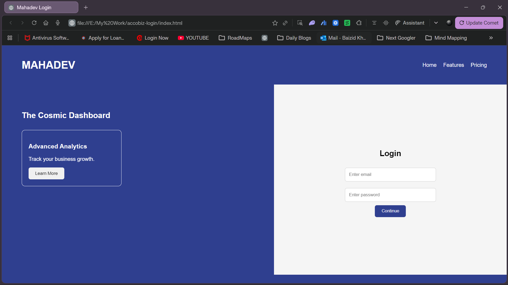

# Mahadev Login Page UI (Clone of Accobiz)

This project is a simple recreation of the Accobiz login page layout using HTML and CSS.

The goal of this project was to practice frontend fundamentals such as layout design, Flexbox, UI alignment, and responsive design.

---

## Preview

---

## Features

- Login form with email and password fields
- Feature cards section
- Layout built using CSS Flexbox
- Responsive design for smaller screens

---

## Technologies Used

- HTML5
- CSS3
- Flexbox

---

## Future Improvements

- Convert the layout to React (JSX)
- Use Styled Components for styling
- Add icons and improved UI design
- Improve mobile responsiveness
